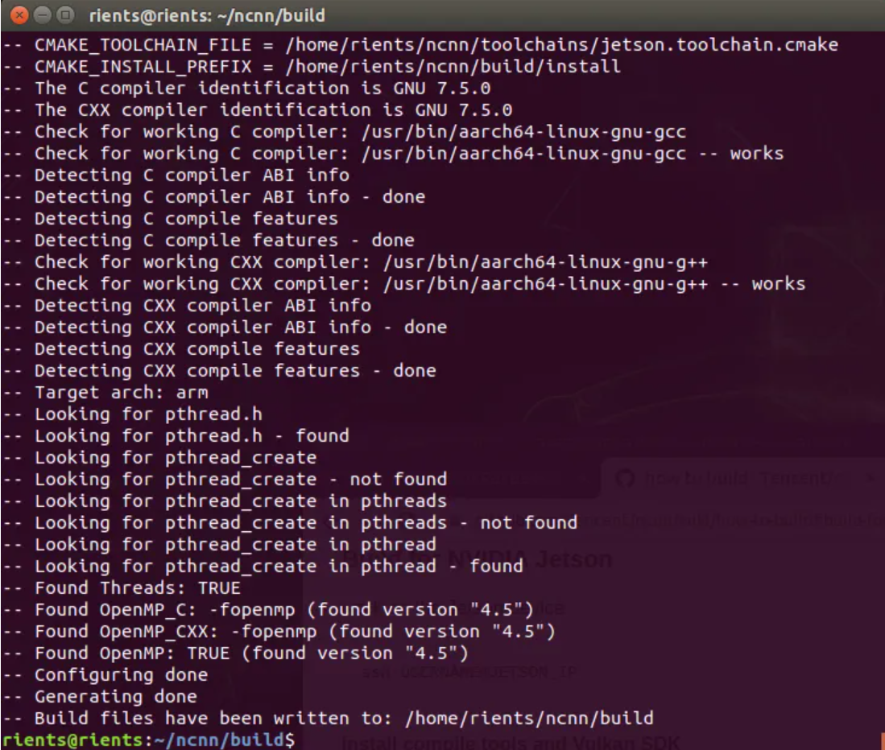
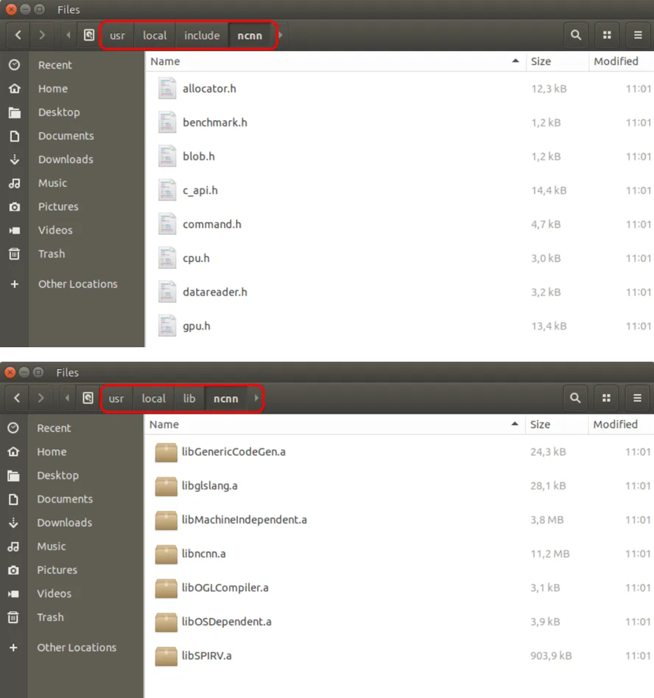
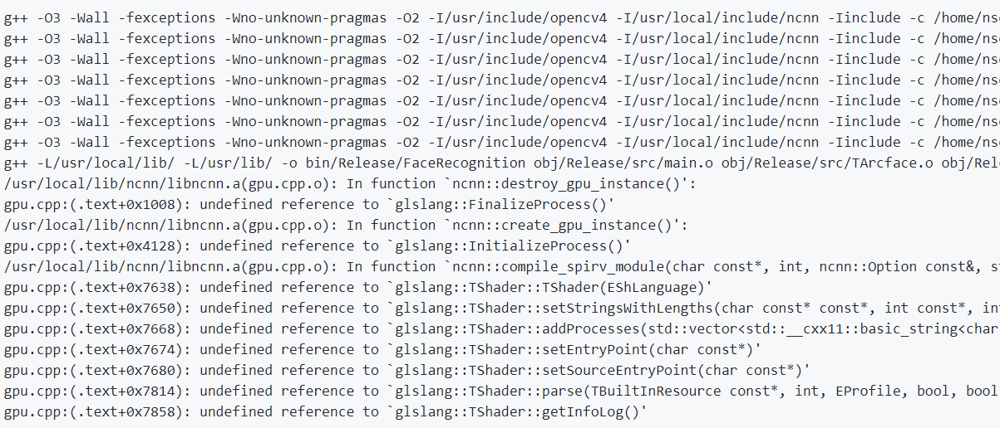

**Read me**
------------

This C++ application recognizes a person from a database of more than 2000 faces. It is built for a Jetson Nano.

First, the faces and their landmarks are detected by **RetinaFace** or **MTCNN**. Next, the database is scanned with **Arcface** for the matching face. In the end, **Face Anti Spoofing** tests whether the person in front of the camera is real and not a mask or a cardboard photo.

If the face is not found in the database, it will be **added automatically**. A **blur** filter ensures only sharp faces in the database. One photo per person is sufficient, although more does not hurt.

------------

**Tasks**

- Real-time face detection
- Recognition of faces entered in the database in real time
- FPS 30+
- Adding and removing faces from the database


------------
**Dependencies**

1.The Tencent ncnn framework installed. Install ncnn

The ncnn framework has almost no dependencies. It requires protobuf to load ONNX models and, of course, the Vulkan SDK. Install OpenCV first if it is not already installed. The installation guide is here and takes about two hours.

The entire installation of ncnn on a Jetson Nano with a Linux Tegra operating system is as follows.
```

$ sudo apt-get update

$ sudo apt-get upgrade

\# install dependencies

$ sudo apt-get install cmake wget

$ sudo apt-get install libprotobuf-dev protobuf-compiler libvulkan-dev

\# download ncnn

$ git clone --depth=1 https://github.com/Tencent/ncnn.git

\# download glslang

$ cd ncnn

$ git submodule update --depth=1 --init

\# prepare folders

$ mkdir build

$ cd build

\# build 64-bit ncnn for Jetson Nano

$ cmake -DCMAKE\_TOOLCHAIN\_FILE=../toolchains/jetson.toolchain.cmake \

`        `-DNCNN\_VULKAN=ON \

`        `-DCMAKE\_BUILD\_TYPE=Release ..

$ make -j4

$ make install

\# copy output to dirs

$ sudo mkdir /usr/local/lib/ncnn

$ sudo cp -r install/include/ncnn /usr/local/include/ncnn

$ sudo cp -r install/lib/\*.a /usr/local/lib/ncnn/

# once you've placed the output in your /usr/local directory,

\# you can delete the ncnn directory if you wish

$ cd ~

$ sudo rm -rf ncnn

$ sudo rm -rf ncnn

```
Installation takes about 2 hours. After successful completion, the terminal window should look like this: 

If everything went well, you will get two folders. One with all header files and one with the libraries as shown in the screen dumps. 

2. Code::Blocks installed. ($ sudo apt-get install codeblocks)

------------

**Possible errors and solutions**

1) Glslang error


If you have the same error, [install NCNN version 20201218](https://github.com/Tencent/ncnn/releases/tag/20201218). 

Download NCNN ncnn-20201218-full-source.zip. After downloading last version ncnn from git, replace the ncnn with ncnn folder with version 20201218. Proceed with the installation according to the instructions above

2) Ncnn installation error

If the installation stops with an error, then you need to increase the paging file.

On the [JetsonHacksNano account on Github, there is a repository named resizeSwapMemory](https://github.com/JetsonHacksNano/resizeSwapMemory). The repository contains a convenience script to set the size of the swap memory.

```
$ git clone https://github.com/JetsonHacksNano/resizeSwapMemory

$ cd resizeSwapMemory

```
To use the script in the repository:

```
usage: ./setSwapMemorySize.sh [ [-g #gigabytes ] | [ -m #megabytes ] | [ -h ]
`  `-g #gigabytes – #gigabytes total to use for swap area
`  `-m #megabytes – #megabytes total to use for swap area
`  `-h – help 

```
Example usage:
```

$ ./setSwapMemorySize.sh -g 4
```

will set the entire swap memory size to 4GB.

This will modify the /etc/systemd/nvzramconfig.sh to set the requested memory for the swap memory as specified.

You will need to reboot for the change to take effect.

------------

**Installing the repository**

Download the repository via git or archive.

------------

**Running the app**

To run the application load the project file FaceRecognition.cbp in Code::Blocks from the folder of the downloaded and unpacked repository.
First, we are going to fill the database with new faces. 

Compile and run the application. You will see that all the faces are correctly recognized and added to database.

------------

**Contributors**

Ivanova Ekaterina

Ivan Tsvetkov

Osikov Alexander

Vitaly Samoilov

**Thanks**
------------

<https://github.com/Qengineering/Face-Recognition-Jetson-Nano>
